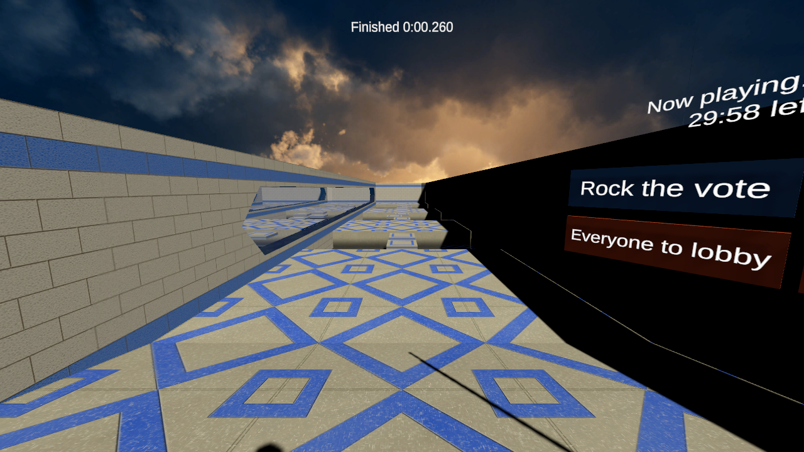
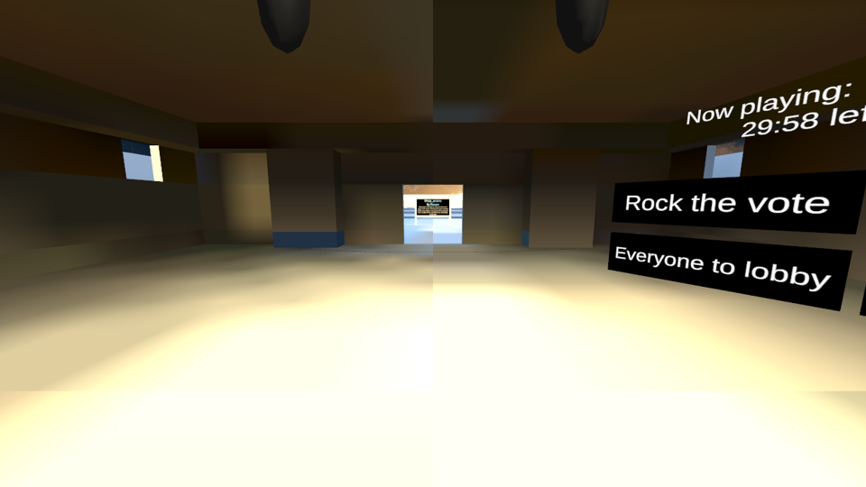
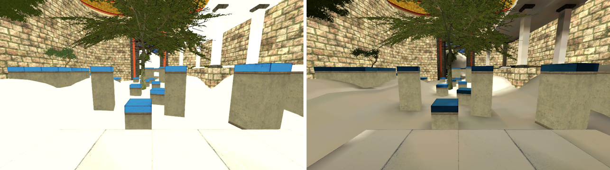
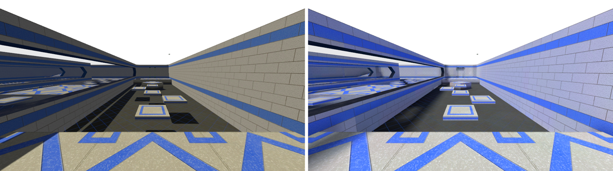
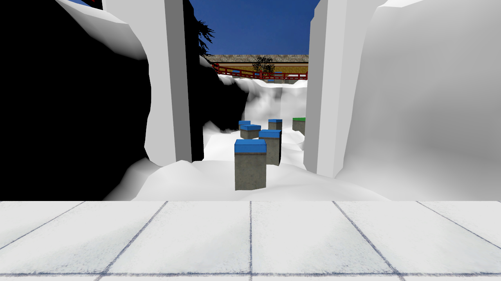
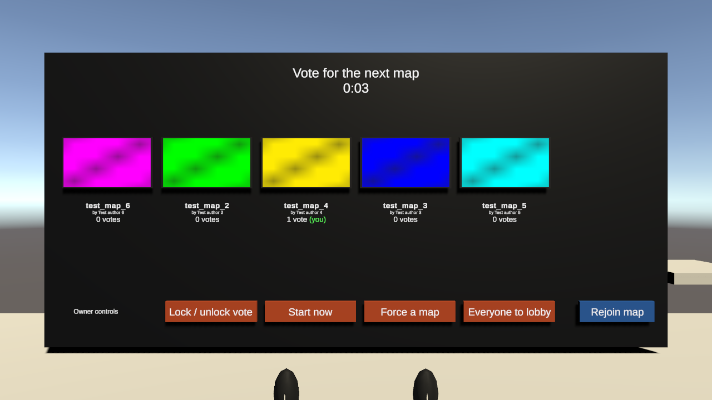
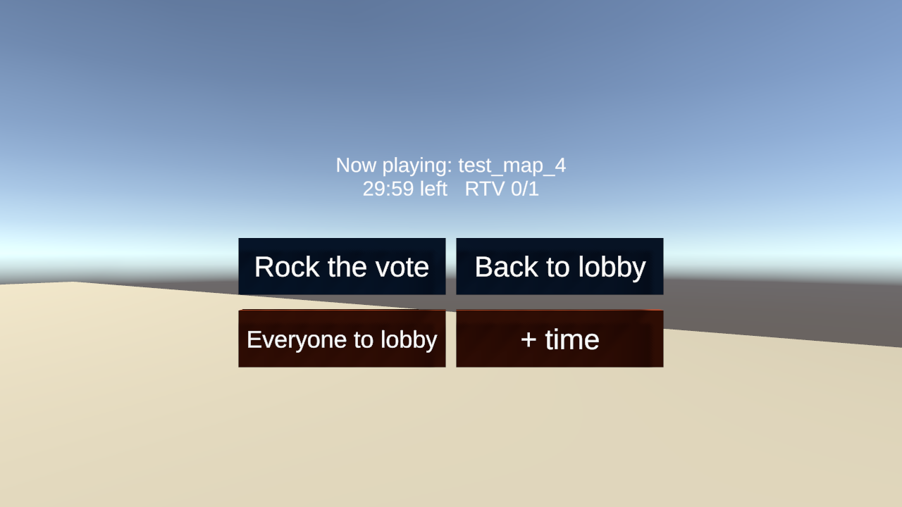

# Setup guide: a CS:S bhop world in VRChat

Step by step, from nothing to an uploaded VRChat world with Source movement, a timer and a lobby where
players vote between imported CS:S bhop maps. Kept up to date as features are finished.

> **Status (2026-10-10).** Done and tested: movement, timer, map import (visuals with uSource and the maps' own
> lightmaps, collision, prop collision, markers, teleports, boosters, water, ladders), bhop and surf runs on every map, timer zones from zones-cstrike, map rotation (vote, rock the
> vote, time limit, owner controls), lobby practice courses, saved records per map. The quickest way to a full world is
> the **sample world builder** (step 5b). Pictures come from Unity itself; editor windows can't be screenshotted on the
> build machine, so menus are described in words.

## 1. What you need

| | Why |
|---|---|
| A Windows PC | VRChat's Creator Companion and world uploads are Windows-first |
| A VRChat account that can upload worlds | Uploading needs the "New User" trust rank or higher |
| [VRChat Creator Companion (VCC)](https://vrchat.com/home/download) | Creates the Unity project with the VRChat SDK |
| Unity Hub + **Unity 2022.3.22f1** | The VCC tells you to install this exact version (it opens Unity Hub for you) |
| **Counter-Strike: Source** (Steam) | The maps use CS:S's stock textures and models; the importer reads them from your game folder |
| This repository | Download it as a zip from GitHub (green "Code" button > Download ZIP) |
| [uSource](https://github.com/DeadZoneLuna/uSource) (DeadZoneLuna) | Converts the maps' visible geometry and textures (see step 4) |

## 2. Create the world project

1. Open the Creator Companion, **Projects > Create New Project**.
2. Pick the **World** template (Udon, with UdonSharp and ClientSim), give it a name, **Create Project**.
3. **Open Project**. Unity starts (first start takes a few minutes).

## 3. Add SourceMovement, SourceTimer and SourceMaps

1. Unzip this repository.
2. Copy the folders `Assets/SourceMovement`, `Assets/SourceTimer` and `Assets/SourceMaps` **and the `.meta`
   files next to them** into your project's `Assets` folder (drag them into Unity's Project window, or copy them
   in Explorer while Unity is closed).
3. Wait for Unity to compile. If it shows UdonSharp errors, use **VRChat SDK > Udon Sharp > Compile All UdonSharp
   Programs** once.
4. **Window > TextMeshPro > Import TMP Essential Resources** (or click **Import TMP Essentials** when Unity asks).
   Without it every text on the boards is invisible. The lobby tool also starts this import if it's missing.

The three parts are independent: SourceMaps works without the other two, but you want all three for a bhop world.

## 4. Install uSource (the map converter)

uSource turns a map's geometry and textures into Unity meshes and materials. We compared it with Shane-SDK's
USource; uSource works with VRChat's render pipeline and lines up with our collision (79% of test rays within
5 cm; the rest are invisible clip brushes and props). Details in [MAPVOTE_PLAN.md](../Dev/docs/MAPVOTE_PLAN.md), step 2.

1. Download uSource from GitHub (Code > Download ZIP) and unzip it into `Assets/uSource` in your project.
2. In Unity, select `Assets/uSource/uSource.asmdef` and tick **Allow 'unsafe' Code**, then **Apply**
   (its model reader needs it).
3. uSource doesn't state a license: use it for your own world and don't redistribute it.

## 5. Get the maps

Download the maps from GameBanana and unzip them (7-Zip opens .zip, .rar and .7z); you need the `.bsp` files.
Put them all in one folder.

| Map | Author | GameBanana |
|---|---|---|
| bhop_japan | Tony Montana | [mods/125304](https://gamebanana.com/mods/125304) |
| bhop_kitsune | Ghost1447951 | [mods/126424](https://gamebanana.com/mods/126424) |
| bhop_eazy_v2 | 31K4L | [mods/124915](https://gamebanana.com/mods/124915) |
| bhop_arcane_v1 | Panzerhandschuh | [mods/124461](https://gamebanana.com/mods/124461) |
| bhop_badges | Badges & fission | [mods/124524](https://gamebanana.com/mods/124524) |

The maps belong to their authors. For a **public** world, ask each author for permission first and credit them
(the vote screen shows the author's name).

### 5b. The quick way: build the sample world

**Tools > Source Maps > Build Sample World...**, pick the folder with the `.bsp` files, then your
**Counter-Strike Source** folder (e.g. `C:\Program Files (x86)\Steam\steamapps\common\Counter-Strike Source`,
the one with `cstrike` and `hl2` in it; asked once). It does steps 6-8 for every map in the folder: visuals,
collision, markers, timer zones, a thumbnail from the spawn, the lobby with practice courses and a records wall, and
saves the scene as `Assets/SourceMapsSample.unity`. Then continue at step 10. Steps 6-8 are for adding maps one by one.

**Lighting:** nothing to bake. The importer uses each map's own Source lightmaps (the light the mapper compiled into
the BSP): every map surface gets a material with the small `SourceMaps/Lightmapped` shader (texture x lightmap, like
CS:S), and the lightmaps are saved as textures in `Assets/SourceMapsImported/<map>/Lightmaps`, so they are part of the
uploaded world. Glass/glowing surfaces keep uSource's materials. Static props (trees, crates...) are lit like CS:S lights them: the map's ambient
light at the prop plus the strongest lights that reach it (the sun only where the sky is visible), baked into the
model's vertex colours (`SourceMaps/Prop` shader). You may see a faint line where two lit faces meet (edges of the lightmap
atlas).

## 6. Import a map (one by one)

1. **Tools > Source Maps > Import BSP...** and pick the `.bsp`. You get an object named after the map with:
   - **Collision**: every solid surface, including invisible walls (clip brushes), without the hidden faces where
     two brushes touch (like Source; those would stop surfers).
   - **Entities**: one marker per map entity (triggers, buttons, ...) keeping all its settings.
   - Working **fall teleports**, **boosters/push triggers**, **water** and **ladders** (for SourceMovement).
   - **Bhop blocks**, like on CS:S servers: stand on a block too long and you're sent back; a clean bhop is fine.
     Both kinds are imported: blocks that rename you when touched plus a teleport that only takes that name
     (bhop_japan, arcane, badges), and `func_door` blocks that sink when touched (bhop_eazy_v2). To make every block a
     plain platform, select the map's **Bhop Blocks** object and untick **On**. Each player's blocks are their own
     (someone else standing on a block doesn't move it for you), as on most bhop servers.
2. Move the map's object to a free spot: every map needs its own place in the world (maps are up to ~620 m across;
   the sample world puts them 700 m apart along X). Do this before adding visuals and zones.
3. **Visuals**: with uSource installed, the sample world builder imports them automatically
   (`SourceMapVisuals.Import`, using your CS:S folder): it removes the tool surfaces Source never draws, gives solid
   props collision and saves the meshes. Doing it by hand: uSource's window with **Unit scale 0.01905**, then drag
   its map object under the map's object.

4. **Timer zones**: select the map object, **Tools > Source Maps > Import Timer Zones (srcwr) For Selected Map**.
   It downloads the zones CS:S bhop servers use for that map ([zones-cstrike](https://github.com/srcwr/zones-cstrike)):
   start, end, stages as checkpoints, and bonus tracks as separate courses. For a map without zones there, add
   TimerZone boxes by hand (a Box Collider set to Is Trigger + Timer Zone, type Start/End; name the start zone
   "Start <map name>" so it gets boards).

## 7. Add the map to the rotation

1. Select the map object, **Tools > Source Maps > Add Selected Map To Rotation**. This adds **Source Map Info**
   and a **Spawn** at the map's first player start.
2. On **Source Map Info**, fill in **Author** and drag a **Thumbnail** image (the sample world builder renders one
   from the spawn; drag your own over it to replace it). **Time Limit Minutes** overrides the lobby's setting for this map (0 = use the lobby's).
3. Check the **Spawn** child: it's where players arrive. Move/rotate it if needed.

## 8. Create the lobby

**Tools > Source Maps > Create Lobby** builds the lobby at the scene origin: a floor, the spawn, the vote board,
owner controls, a small panel next to each map's spawn, and two **practice courses** beside the lobby (a short
bhop lane on one side, a small surf ramp on the other, each with its own legit and auto-bhop boards). It uses every
map added in step 7 and moves the VRC World spawn into the lobby. Run it again whenever you add a map (it replaces
the old lobby). Add the SourceMovement prefab before you run it, so the practice boards split auto and legit bhop.

Only one map is ever active: everyone plays the map that won the vote. The lobby is always open (**Back to lobby**),
and **Rejoin map** takes you back in.

Settings on **SourceMapManager** (under "SourceMaps Lobby"):

| Setting | Default | What it does |
|---|---|---|
| Choices | 5 | Maps offered per vote (2-6), picked at random from all maps; the map just played isn't offered |
| Vote Seconds | 60 | Timer from the first vote to the result |
| Rtv Ratio | 0.6 | Share of players needed to "rock the vote" (start a new vote) |
| Time Limit Minutes | 30 | Then a new vote starts, with "extend" offered. **0 = rock the vote only** |
| Extend Minutes | 15 | Added when "extend" wins or the owner presses "+ time" |

## 9. Movement and timer

1. Drag `Assets/SourceMovement/SourceMovement.prefab` into the scene (Source movement, auto bhop button).
2. The run timer (`SourceTimer.prefab`) is added by the lobby tool if it isn't in the scene yet.
3. Records: Create Lobby puts a **records wall** behind the lobby spawn with a legit and an auto-bhop board for
   every course (each map, each bonus track) that has a start zone named "Start <course>".

**Saved records.** Boards with a **Save Key** (the practice boards have one) keep each player's best with VRChat
Persistence. VRChat saves data per player, not per world, so a board shows the bests of everyone who has been in
the current instance, including their saved bests from earlier sessions. There is no world-wide all-time board.

## 10. Test in Unity

Press **Play**. ClientSim (VRChat's simulator) starts you in the lobby. Click a map's thumbnail to vote
(desktop: look at it and left-click; the timer starts with the first vote). In Play mode you are the instance
owner, so you also see the owner buttons.

## 11. Upload

1. **VRChat SDK > Show Control Panel**, sign in, **Builder** tab.
2. Platform: **Windows** only (the maps are too big for Quest/Android).
3. **Build and Upload**. Big maps make big worlds: check the size it reports.

## 12. Playing it in VRChat

- **Practice courses** next to the lobby: walk onto the green start pad, run to the red end pad. Falling off sends
  you back to the start; **G** (desktop) restarts. Times go on the boards beside the course.
- **Lobby board**: press a map to vote (press another to change your vote). The vote ends 60 s after the first
  vote; ties are broken at random. Everyone is teleported to the winner.
- **In a map**: the panel next to the spawn shows the time left and the rock-the-vote count. **Rock the vote**
  (press again to take it back): at 60% of players a new vote starts in the lobby. **Back to lobby** takes only
  you back; **Rejoin map** on the lobby board takes you back in.
- **Time limit**: when it runs out everyone goes to the lobby for a vote that also offers "Extend".
- **Instance owner** (the master in public/group instances, which have no owner) sees red buttons: **Lock / unlock
  vote** (stops the timer; only Start ends it), **Start now**, **Force a map** (then press a map), **Everyone to
  lobby**, and **+ time** in maps.

## Settings reference

Every setting you can change (movement cvars, layers, timer, boards, map rotation), with defaults and presets,
is in **[SETTINGS.md](SETTINGS.md)**.

## Troubleshooting

| Problem | Fix |
|---|---|
| Players fall through a map | Was **Import BSP** run (step 6b)? The visuals from uSource have no collision |
| Map looks white/pink | uSource's root path must point at your CS:S folder; pink = shader problem, re-import |
| Two maps overlap | Move the map objects apart (step 6b.4) |
| Owner buttons don't show | Only the instance owner sees them; in public/group instances, the master |
